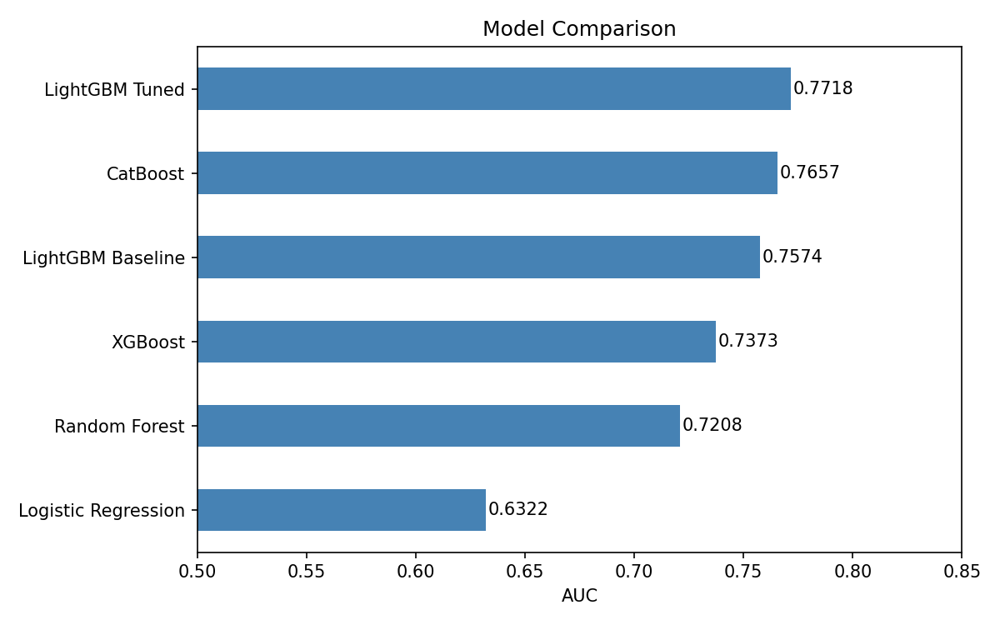
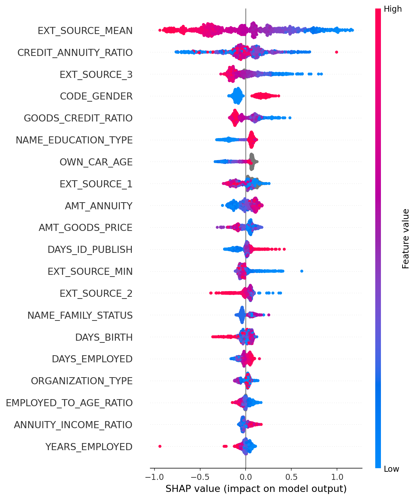

# Gradient Boosting Model - Home Credit Default Risk

## Project Overview
A supervised machine learning pipeline to predict loan default risk using the
Home Credit Default Risk Kaggle dataset. The main evaluation metric is AUC.

## Results
| Model | AUC |
|---|---|
| LightGBM Tuned | 0.7718 |
| CatBoost | 0.7657 |
| LightGBM Baseline | 0.7574 |
| XGBoost | 0.7373 |
| Random Forest | 0.7208 |
| Logistic Regression | 0.6322 |

## Key Visualisations

### Model Comparison


LightGBM with hyperparameter tuning achieved the best AUC of 0.7718, significantly
outperforming Logistic Regression (0.6322). This confirms that default risk is a
non-linear problem that tree-based models handle much better than linear models.
CatBoost performed strongly out of the box at 0.7657 with no tuning.

### SHAP Summary


The SHAP plot shows both the importance and direction of each feature's effect.
EXT_SOURCE_MEAN is the strongest predictor - low external credit scores (blue) push
predictions towards default, while high scores (red) reduce default probability.
CREDIT_ANNUITY_RATIO, an engineered feature, is the second most important - a high
ratio means the applicant is borrowing a lot relative to their repayment amount,
increasing default risk.

## Project Structure
gradient_boosting_project/
├── data/             # Raw dataset from Kaggle
├── notebooks/        # Jupyter notebook with full analysis
├── src/              # Python scripts
├── outputs/          # Saved charts and results
├── reports/          # Final report
└── requirements.txt  # Python dependencies

## Key Findings
- EXT_SOURCE features are the strongest predictors of default
- Feature engineering improved AUC by 0.007
- LightGBM outperformed all other models
- Class imbalance (8% default rate) makes AUC more appropriate than accuracy

## Setup
```bash
conda create -n gradient_boosting python=3.11
conda activate gradient_boosting
pip install -r requirements.txt
```

## Data
Download from Kaggle: https://www.kaggle.com/c/home-credit-default-risk/data
